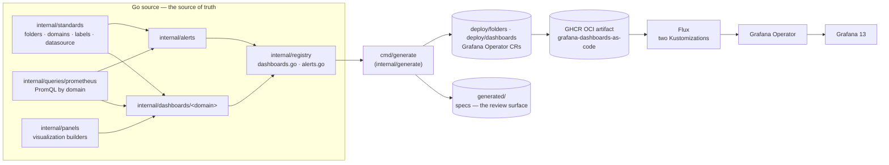
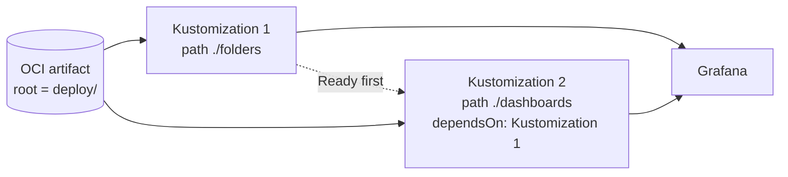

# Grafana Observability as Code

Typed Grafana dashboards and alert rules written in Go with the
[Grafana Foundation SDK](https://github.com/grafana/grafana-foundation-sdk),
generated into Grafana Operator resources and shipped to the cluster as one
OCI artifact.

| | |
|---|---|
| **Dashboard model** | Dashboard v2 (`dashboard.grafana.app/v2`), so **Grafana 13 or newer**; 12.0 and 12.1 serve no higher than `v2alpha1` |
| **Delivery** | `GrafanaManifest` + `GrafanaAlertRuleGroup` CRs, published to `ghcr.io/duynhlab/grafana-dashboards-as-code`, applied by Flux |
| **Inventory** | 18 dashboards · 6 folders · 4 alert rules |
| **Toolchain** | Go `1.27.1` (`go.mod`), Foundation SDK `v0.0.20` |
| **Tested against** | Grafana `13.2.0` on Grafana Operator `5.25.0` in Kind (`make e2e-kind`) |
| **Quality gates** | `gofmt` + `go vet`, 90% coverage, byte-identical regeneration, read-back of every board |
| **Latest release** | tag `v0.2.2` (there are no GitHub Releases; tags are the versions) |
| **Consumer** | [`duynhlab/homelab`](https://github.com/duynhlab/homelab), pinned to `semver: "0.2.2"` |

## Contents

- [Architecture](#architecture)
- [Dashboards](#dashboards) · [Folders](#folders) · [Alert rules](#alert-rules)
- [Requirements](#requirements) · [Make targets](#make-targets)
- [Repository layout](#repository-layout) · [Development](#development)
- [Kubernetes delivery](#kubernetes-delivery) · [Testing](#testing)
- [CI and publishing](#ci-and-publishing) · [Consumers](#consumers)
- [Agent configuration](#agent-configuration)

## Architecture



Everything under `internal/` is hand-written. `generated/` and `deploy/` are
reproducible generator output: never edit them by hand. CI regenerates and fails
on any difference.

## Dashboards

Every query uses the logical datasource `prometheus`, resolved at deploy time
(homelab maps it to VictoriaMetrics). *Elements* is the number of panels and
other elements in the generated spec.

| Folder | UID | Title | Elements | What it shows |
|---|---|---|---:|---|
| Kubernetes | `kubernetes-cluster-overview` | Kubernetes Cluster Overview | 24 | Cluster health by the USE method: node and pod counts, workload health, utilization, persistent-volume storage |
| Kubernetes | `kubernetes-workloads` | Kubernetes Workloads | 11 | Per-workload and per-pod CPU, memory, network and reliability, filtered by namespace and owner |
| Kubernetes | `keda` | KEDA — Worker Autoscaling | 17 | What the Temporal scaler computed per worker version, what the HPA did, the backlog it scales on, KEDA's own health |
| Databases | `pg-io-waits` | PostgreSQL — IO & Waits (pg_stat_io) | 10 | IO attribution from PostgreSQL 18 `pg_stat_io` and sampled wait classes |
| Databases | `pg-maintenance` | PostgreSQL — Maintenance (CNPG) | 15 | Locks and blocking, checkpointer, autovacuum and bloat, long transactions, VACUUM progress |
| Databases | `pg-query-performance` | PostgreSQL — Query Performance (pg_stat_statements) | 14 | Throughput, latency, cache efficiency, block I/O, top statements |
| Databases | `pg-exporter-instance` | PG Exporter Instance | 61 | Remote/RDS instances via the Pigsty `postgres_exporter` model (`pg_*` metrics, `pg:*` rules, `ins`/`cls` labels — not `cnpg_*`) |
| Databases | `pgdog` | PGDog | 30 | PGDog pooler: clients, servers, transactions, queries, traffic, prepared statements, mirroring |
| Observability | `temporal-worker` | Temporal — Workflows & Activities | 21 | Both halves of Temporal: SDK/worker metrics over OTLP and server metrics (gRPC by role, persistence, task-queue backlog) |
| Observability | `otel-collector-health` | OTel Collector Health | 10 | Collector pipeline throughput, exporter fan-out, self resource usage |
| Microservices | `microservices-monitoring-001-otel` | Microservices (OTel) | 40 | 1:1 port of the helm-charts board: Go services RED, Go runtime and HTTP I/O, east-west gRPC by method and per callee, and the `otelpgx` DB client and pool, from OpenTelemetry semantic-convention metrics keyed on `service_name` |
| Microservices | `business-otel` | Microservices — Business KPIs | 38 | Business KPIs, one row per domain: payments, orders and saga, auth, product, cart, shipping, user, review, notification, checkout |
| Microservices | `red-spanmetrics` | Microservices — RED Span Metrics | 8 | RED per service from the Collector's spanmetrics connector — distinct from the board above, which reads `http_server_*`/`rpc_server_*` directly |
| Microservices | `rfc0021-baseline` | Order Saga & Payment — Cutover Baseline | 8 | The order-saga and payment signals every cutover gate is judged against |
| Microservices | `inventory-overview` | Inventory Service — Stock Authority | 7 | Reservation FSM outcomes, availability checks, gRPC RED, DB latency |
| Platform | `cert-manager` | cert-manager | 16 | Certificate readiness and time to expiry, controller sync, work queues, ACME traffic |
| Platform | `keycloak-identity` | Keycloak — Identity | 18 | Auth event rates and failure ratio, realm and token endpoint latency against a 250 ms SLO, JVM and DB pool |
| API Gateway | `eg-edge` | Envoy Gateway — Edge Overview | 21 | Edge golden signals on the data plane, control-plane health, process-level resources |

Notes:

- **Recording rules required.** `rfc0021-baseline` and `inventory-overview` read
  `rfc0021:*` and `inventory:*` recording rules, not raw metrics. They live in
  homelab under
  `kubernetes/infra/configs/observability/metrics/prometheusrules/microservices/`;
  without them the two boards are empty.
- **PostgreSQL version.** The PostgreSQL boards are tested on PostgreSQL 18.
- **Provenance.** Ported boards record the source path and the commit they were
  read at in their query file. `microservices-monitoring-001-otel` and
  `business-otel` came from the `duynhlab/helm-charts` `grafana-dashboards` chart,
  `pgdog` from Grafana.com dashboard 24583, and the rest from JSON that homelab
  used to vendor.

## Folders

| Title | UID | Dashboards | Alert groups |
|---|---|---|---|
| Kubernetes | `kubernetes` | `kubernetes-cluster-overview`, `kubernetes-workloads`, `keda` | `kubernetes` |
| Databases | `databases` | `pg-io-waits`, `pg-maintenance`, `pg-query-performance`, `pg-exporter-instance`, `pgdog` | `databases` |
| Observability | `observability` | `temporal-worker`, `otel-collector-health` | — |
| Microservices | `microservices` | `microservices-monitoring-001-otel`, `business-otel`, `red-spanmetrics`, `rfc0021-baseline`, `inventory-overview` | — |
| Platform | `platform` | `cert-manager`, `keycloak-identity` | — |
| API Gateway | `api-gateway` | `eg-edge` | — |

The folder UID is the slug of its title. Other dashboards can share these folders
by UID; homelab files its Envoy Gateway, service-graph and Vector boards into
`api-gateway`, `microservices` and `observability`.

## Alert rules

| UID | Title | Group / folder | Severity | For | Linked dashboard | Fires when |
|---|---|---|---|---|---|---|
| `kubernetes_crashlooping_pods` | Kubernetes crashlooping pods | `kubernetes` / Kubernetes | warning | 5m | `kubernetes-cluster-overview` | any container is waiting in `CrashLoopBackOff` |
| `kubernetes_pending_pods` | Kubernetes pending pods | `kubernetes` / Kubernetes | warning | 15m | `kubernetes-cluster-overview` | any pod is `Pending` |
| `kubernetes_pvcs_at_risk` | Kubernetes PVCs above 80% used | `kubernetes` / Kubernetes | warning | 15m | `kubernetes-cluster-overview` | any PVC is more than 80% full |
| `postgres_backends_waiting` | PostgreSQL backends waiting | `databases` / Databases | warning | 10m | `pg-io-waits` | CNPG reports waiting backends |

Every rule shares one shape: a 1-minute group interval, an instant query over the
last 10 minutes against datasource UID `prometheus`, a threshold of `> 0`, and
`NoData` / `Error` as the no-data and error states. Each rule carries the
`dashboard_uid` annotation of the board that explains it.

## Requirements

| Tool | Version | Needed for |
|---|---|---|
| Go | as in `go.mod` (`1.27.1`) | everything |
| Grafana | 13 or newer | serving `dashboard.grafana.app/v2` |
| Grafana Operator | 5.x (tested on `5.25.0`) | applying the CRs |
| Flux CLI | 2.x | publishing the OCI artifact |
| Kind, kubectl, Helm, python3 | recent | `make e2e-kind` |

## Make targets

| Target | What it does |
|---|---|
| `make generate` | Runs `cmd/generate`: writes `generated/` and `deploy/` from the registries |
| `make test` | `go test ./...` |
| `make coverage` | Repository-wide coverage with a **90%** gate. Profiles are merged per block (highest count wins), so the figure does not swing with the test cache |
| `make fmt` | `gofmt -w .` |
| `make lint` | `gofmt` check and `go vet` |
| `make generated-check` | Regenerates and fails if `generated/` or `deploy/` changed |
| `make validate` | `lint` + `coverage` + `generated-check` — **the definition of done** |
| `make e2e-kind` | The Kind smoke test (see [Testing](#testing)); needs Docker |

The everyday loop:

```bash
make generate        # after editing internal/
make validate        # before every commit
make e2e-kind        # before a release, or after touching delivery
```

## Repository layout

```text
cmd/generate/              entry point of the generator
internal/
  standards/               folders, domains, labels, the datasource, time settings
  queries/prometheus/      PromQL by domain
  panels/                  reusable visualization builders
  dashboards/<domain>/     dashboard composition: gateway, kubernetes, microservices,
                           observability, platform, postgres
  alerts/                  alert rule definitions
  registry/                dashboards.go and alerts.go — what gets generated
  generate/                the deterministic renderer
generated/
  dashboards/<domain>/     Dashboard v2 specs and manifests (review surface)
  alerts/<domain>/         alert definitions
deploy/
  folders/                 wave 1: one GrafanaManifest per folder
  dashboards/              wave 2: one GrafanaManifest per dashboard, the alert groups
  kustomization.yaml       both waves, for a single apply
test/
  dashboards/              cross-resource contract tests
  e2e/kind/                the Grafana Operator smoke test
dashboard/                 two hand-made boards homelab still fetches by raw URL
  redis/redis.json             (GrafanaDashboard "redis")
  postgresql/cloudnative-pg-cluster.json   (GrafanaDashboard "cloudnative-pg")
docs/audit-as-code.md      the as-code design audit
.github/                   workflows/as-code.yml, dependabot.yml
.agents/skills/            the project Agent Skill (see below)
AGENTS.md                  repository-wide agent instructions
```

> **Do not move or rename the two files under `dashboard/`.** homelab reads them
> from `main` by raw URL, so a rename breaks both boards on the next resync.

## Development

### Add a dashboard

1. Add or reuse queries under `internal/queries/prometheus/<domain>/`.
2. Compose panels and rows under `internal/dashboards/<domain>/`.
3. Register it in `internal/registry/dashboards.go` with its `Domain` (required)
   and its folder.
4. Add an alert rule when the board answers an operational question.
5. Run `make validate` and commit the regenerated `generated/` and `deploy/`.

### Add an alert rule

1. Reuse the query the dashboard already plots, so the rule and the board agree.
2. Define it under `internal/alerts/` with the standard labels and the
   `dashboard_uid` annotation.
3. Give it a `Group`: the generator emits one `GrafanaAlertRuleGroup` per group.
4. Register it in `internal/registry/alerts.go`, then run `make validate`.

### Add a domain

1. Add a `Domain*` constant in `internal/standards/domains.go`.
2. Add or reuse its folder in `internal/standards/folders.go`. A domain is not a
   folder: the `postgres` domain's five boards land in the `Databases` folder, so
   neither name is derived from the other.
3. Register resources with them. The generator discovers folders from the
   registries, so `cmd/generate` does not change.

## Kubernetes delivery

`kubectl kustomize deploy/` renders the whole bundle:

| Resource | One per | Applies |
|---|---|---|
| `GrafanaManifest` → `folder.grafana.app/v1` `Folder` | folder | wave 1, `deploy/folders/` |
| `GrafanaManifest` → `dashboard.grafana.app/v2` `Dashboard` | dashboard | wave 2, `deploy/dashboards/` |
| `GrafanaAlertRuleGroup` | alert group | wave 2, `deploy/dashboards/` |

### Why `GrafanaManifest` and not `GrafanaDashboard`

`GrafanaDashboard` always posts through the legacy `/api/dashboards/db`
envelope; its content sources (`oci`, `url`, `configMapRef`, `json`,
`grafanaCom`, `jsonnet`) only change how the bytes arrive. A Dashboard v2 payload
is refused either way: the bare spec returns `400 dashboard appears to be in v2
format`, and the wrapped object that error asks for returns `400 The k8s style
dashboard must not include an id on the root element`. The operator sets an `id`
on every model before posting, so that cannot be fixed from this side.

`GrafanaManifest` applies its payload with a discovery-based dynamic client
against `/apis`, the protocol the schema speaks. The trade-off is that it has no
content sources: each spec is inlined, so one object is bounded by the etcd limit
of about 1 MiB.

### Two waves

A dashboard whose `grafana.app/folder` names a folder that does not exist yet
fails, then waits for the operator's next resync — long enough for a Flux wave to
time out red. Ordering inside one kustomization does not help, because kustomize
order is not apply order across independent controllers. So the folders apply
first:



Paths are relative to the artifact, whose root is `deploy/`. Both Kustomizations
need `healthCheckExprs` on the `ManifestSynchronized` condition (with
`observedGeneration`), because `GrafanaManifest` does not report the `Ready`
condition kstatus expects.

## Testing

| Layer | Command | What it proves |
|---|---|---|
| Unit and contract tests | `make test` | Builders, queries and cross-resource invariants (e.g. every alert's `dashboard_uid` exists) |
| Coverage | `make coverage` | At least 90% of statements, measured over the whole module |
| Determinism | `make generated-check` | Regeneration is byte-identical to what is committed |
| End to end | `make e2e-kind` | The bundle works on a real Grafana Operator |

`make e2e-kind` creates a Kind cluster, installs Grafana Operator `5.25.0` and
Grafana `13.2.0`, applies `deploy/folders` and then `deploy/dashboards`, and
waits for every `GrafanaManifest` to report `ManifestSynchronized`. It then
**reads every board back** through
`/apis/dashboard.grafana.app/v2/namespaces/default/dashboards/<uid>` and compares
the title and element count with the generated spec. The read-back is the real
test: Grafana 12.0's legacy save path accepts nearly arbitrary JSON and still
reports a synchronized condition, so a CR condition alone proves nothing. The
expected set comes from `deploy/`, so a newly registered board is covered with
no test change.

## CI and publishing

`.github/workflows/as-code.yml` runs on pull requests to `main`, pushes to
`main`, and `v*` tags.

| Job | Runs on | Checks |
|---|---|---|
| `validate` | every run | `gofmt`, `go vet`, 90% coverage, regeneration diff, `kustomize build` of `deploy`, `deploy/folders` and `deploy/dashboards` (no `GrafanaDashboard` may appear), one CR per generated spec |
| `e2e-kind` | every run | `make e2e-kind`'s script |
| `publish-oci` | pushes only (`main`, tags) | pushes `deploy/` as a reproducible Flux OCI artifact |

Tags on `ghcr.io/duynhlab/grafana-dashboards-as-code`:

| Tag | Moves on | Use |
|---|---|---|
| `vX.Y.Z` | a `vX.Y.Z` git tag | **pin this** |
| `sha-<7-char sha>` | each push to `main` | an exact build of `main` |
| `latest` | every push to `main` and every tag | inspection only, never pin |

`generated/dashboards/` is not published separately. `GrafanaManifest` cannot
fetch content, so nothing would pull it; the specs stay committed as the review
surface.

## Consumers

| Consumer | Object | Reads |
|---|---|---|
| homelab | `OCIRepository` `grafana-dashboards-as-code-oci` | this artifact, `semver: "0.2.2"` |
| homelab | `Kustomization` `grafana-dashboards-as-code-folders-local` | `./folders`, health-checked on the six folder manifests |
| homelab | `Kustomization` `grafana-dashboards-as-code-dashboards-local` | `./dashboards`, `dependsOn` the folders wave, health-checked on all 18 boards |
| homelab | `GrafanaDashboard` `redis`, `cloudnative-pg` | `dashboard/redis/redis.json` and `dashboard/postgresql/cloudnative-pg-cluster.json` by raw URL on `main` |

All 18 boards reach the cluster only through this artifact. Historically,
`microservices-monitoring-001-otel` and `business-otel` were also served by the
`duynhlab/helm-charts` `grafana-dashboards` chart; homelab removed those
`configMapRef` dashboards when it moved to this artifact (homelab #1085), and the
two must never be active against one Grafana at the same time, because their UIDs
collide.

## Agent configuration

The project Agent Skill lives in
[`.agents/skills/grafana-foundation-sdk/`](.agents/skills/grafana-foundation-sdk/SKILL.md),
in the [Agent Skills](https://agentskills.io) format. It holds the architecture,
domain, alerting, testing, CI/CD, end-to-end and multi-agent conventions of this
repository. `.agents/skills/` is the canonical location (OpenAI Codex reads it
natively); `.claude/skills/grafana-foundation-sdk` and
`.cursor/skills/grafana-foundation-sdk` are symlinks to it.
[`AGENTS.md`](AGENTS.md) holds the repository-wide instructions, and `CLAUDE.md`
imports it.
